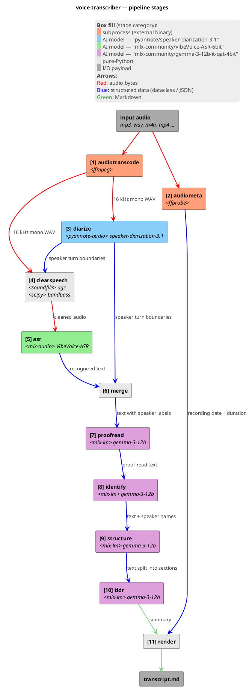

# Architecture

voice-transcriber is a thin CLI on top of a linear in-process pipeline. The CLI parses arguments, builds a `PipelineOptions`, and hands it to `pipeline.run()`. Each stage is a small module with a single public function; intermediate results live in memory, and the only on-disk artefact (besides the input audio) is the final Markdown file.

External work — ASR inference, diarization, LLM prompting — is delegated to local libraries so the pipeline contains no model code itself: mlx-audio drives the VibeVoice model directly, pyannote.audio runs the diarization graph on the local GPU/CPU, and `llm.py` loads the LLM in-process via `mlx-lm` (no HTTP).

## High-level architecture

The CLI hands a `PipelineOptions` (whose load-bearing field is the audio path) to `pipeline.run()`. The orchestrator delegates the heavy work to four external libraries — `ffmpeg`/`ffprobe`, `mlx-audio` (VibeVoice-ASR), `pyannote.audio`, `mlx-lm` — and writes a single Markdown file back to the user.


## Pipeline stages

`pipeline.run()` runs eleven steps in order. audiotranscode (ffmpeg → 16 kHz mono WAV) and audiometa (ffprobe) both start from the user's input file; diarize then reads the temp WAV first to produce per-turn boundaries, the **clearspeech** stage uses those boundaries as guard-rails for a chain of DSP effects (AGC, optional bandpass), and ASR finally consumes the output of the last applied effect. Everything from merge onwards passes structured Python dataclasses around. Only the final two edges (TL;DR string → render → file) are Markdown. The clearspeech chain absorbs new audio-cleanup effects (denoise, presence boost, de-esser planned in PR-2..4) without growing the stage count.



![Pipeline stages](https://www.plantuml.com/plantuml/svg/dLR1Sk964BthAxhCnIOhm8OOGr6gnM0IRsNZBRFb71mTHj8Wff1cbD5eRUrfFo9Vc2z9pmY4Z9131LMfqAZVUwrHlsvzJ1MHAeiZIp4LKVWcc4zj9GbFVSayAk6V7tz3mX8QCKu1eqEQMkc6yOH84eCluaHmojLIvGYNr5U4Xn6jX4ob52zVrypVS9gcS5Mv5T6Gyk1Mo83AcOY41AECDv6n7aVyJIX5neCYjdLdVfRrFF4S3CqKa2nWOjBrd3_vX3bnqly0B-JR1uW714_903gTpgJB71T82lS6qfgEz658Ti-Tg4uSQ1eJzv2fQg1LFZES8URvqYra2x08QAa_MQtYX8QELZpJJ7zCdw2rM4nxm-aXozMM9QQAL0aIAJowPrWicWZwBWICIFQzef_aX7EXg6se7KWJIZPKsaKWKKnmkz-vBDddk0wjc-7iRb7Z7xZWHvH8vA3-Ug-HwXUoOX5rW8I-fjgk-op97V083nAIfgN6R8alxaOVXme_wzsMU-OuUjqb_eIb-6HASxfyBAdmFxH6lRkxKU-Gwzg5cChGx8M9_QolcfI7Bk0-YvMa97Yh7yKEX3IEYTstBw-yKlgBIB4YvlDfRpu_PBjnWGLunLRvQMJtEhg9RUIYwsJcgqpIq-YM9ho9xxBdWee2UHhNrz_cZurCMFbeLFHkkSkFvhBSPgkmcFtSaZHmRGVBjxQ4dh0iROpzaYd3CKnyRVDnQz3JXtDv3PjVlqCikD2WITVSTWwmM5ud8uqEGhqeeqtOhMK0jv-3fsiThKFJaWCnUt5Ta3K6xHfEWrrlsk8i7LlHBkgp1iQ6AaAEfWv0qLVLc7e3_B-ojmfSXSWKTer7QyCBK-jT2u68U3JQ4nbOXQOewHgFSPcjRVRsSOhm2dvRmySJ-QdCWfEuyZHRK8N6bEznaZI9c0B6bO0KfnQsmigsO9kji6oh-kZBaG7Z8GH4KKmhoAHfgYMHqKUcuMms7yxUuqepD9_CI-GsxWss64IMLOn3K281oSArik2GhTs-5Q-0NJbgj-7SJ6tmCSTGoFnYN8eWpiEXEjwE50TmeQjNd7fw7huxNm_mSzmzAZc9m6CSKxweqnKJv1swwJswCQ2H-ReususfRiDyEgih55t_P0NTuh1xnHbdAk--cIRsjSVK4OMYv_rFXKehjPco_oBA7XoNAJhbEp89zdtxIwxMbR8gqSKdoJle--u392IFX1viU_HXjPXlj7JSRjU3iBKvZxH4rmhNj3NmSbKnOWdM3d9kyTG8BsTRe4r4u5oV_GY_6A0BdvOFlrySoRi_7StxK-SNIIblPFvCv2OGB_jTqvufh6Dzn1D-zFuB)

## Module layout

```
src/voice/
├── cli.py           # argparse, --help, dispatch to pipeline.run()
├── pipeline.py      # PipelineOptions + run(): audiotranscode → audiometa → diarize → clearspeech → ASR → merge → proofread → identify → structure → tldr → render
├── types.py         # shared dataclasses (AsrSegment, DiarTurn, Segment, Section, StructuredDialog, AudioMeta)
├── ffprobe.py       # extract_metadata(): start/end/duration from ffprobe → birthtime → mtime
├── diarize.py       # diarize(): pyannote 3.1, MPS+CPU fallback, exclusive turns
├── clearspeech.py   # clearspeech(): chain-of-DSP-effects (AGC + bandpass in PR-1; presence / de-ess / denoise planned)
├── asr.py           # transcribe(): mlx-audio wrapper, bitness 4/5/6/8, JSON timeline parse
├── merge.py         # merge(): per-segment max-overlap mapping ASR↔pyannote
├── proofread.py     # fix_asr_errors(): per-segment LLM proof-reader with safety net
├── identify.py      # identify_speakers(): LLM self-intro detection with override / ask / keep
├── structure.py     # structure_dialog(): LLM-driven section layout with validation
├── tldr.py          # generate_tldr(): LLM markdown summary
├── render.py        # render_markdown(): final output
├── speaker_emojis.py # fixed palette assignment
└── llm.py           # MlxLLM: in-process mlx-lm wrapper with chat / chat_json (lm-format-enforcer)
```

## Data flow

The pipeline passes increasingly enriched `Segment` lists from stage to stage. Numbers match the labels in the diagram and the log lines.

1. **audiotranscode** — `ffmpeg` subprocess writes a 16 kHz mono PCM WAV to a temp dir.
2. **audiometa** — `ffprobe.extract_metadata(audio)` → `AudioMeta` (start/end/duration). Goes straight to render.
3. **Diarize** — `diarize.diarize(wav)` → `DiarTurn[]` (pyannote timeline). Runs on the raw WAV so its boundaries are not influenced by AGC.
4. **Clearspeech** — `clearspeech.clearspeech(wav, chain, agc_turns=turns, ...)` runs an ordered chain of DSP effects. PR-1 chain: `agc → bandpass`. Each enabled effect writes a sibling WAV (`<stem>.agc.wav`, `<stem>.agc.bandpass.wav`, …) and the next effect reads it; ASR consumes the last applied effect's output. With `--no-clearspeech-agc` and bandpass off, the chain is empty and ASR receives the raw WAV. See [ADR 0010](adr/0010-clearspeech-chain.md) for the chain-of-effects design rationale.
5. **ASR** — `asr.transcribe(cleaned_wav)` → `AsrSegment[]` (text + ASR-side speaker hint).
6. **Merge** — joins (3) and (5) into `Segment[]` (text + pyannote speaker label).
7. **Postprocess** — LLM proof-reads `content` per segment in-place.
8. **Identify** — LLM returns `{label → name}`; pipeline assigns `.name` on each segment.
9. **Structure** — LLM produces `StructuredDialog` (segments + section titles).
10. **TL;DR** — LLM emits a Markdown summary string.
11. **Render** — combines `AudioMeta`, `StructuredDialog`, and the TL;DR into the final Markdown file.

See [`pipeline.md`](pipeline.md) for the step-by-step sequence with timing details, [`prompts.md`](prompts.md) for the LLM call contracts powering stages 7–10, and [`adr/README.md`](adr/README.md) for the index of architectural decisions behind these boundaries.
