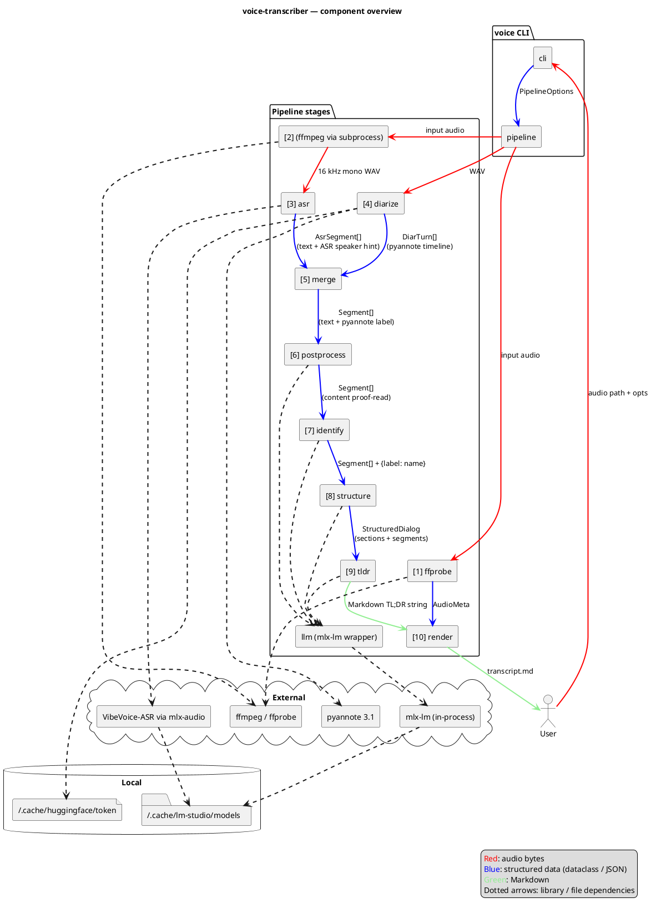

# Architecture

voice-transcriber is a thin CLI on top of a linear in-process pipeline. The CLI parses arguments, builds a `PipelineOptions`, and hands it to `pipeline.run()`. Each stage is a small module with a single public function; intermediate results live in memory, and the only on-disk artefact (besides the input audio) is the final Markdown file.

External work — ASR inference, diarization, LLM prompting — is delegated to local libraries so the pipeline contains no model code itself: mlx-audio drives the VibeVoice model directly, pyannote.audio runs the diarization graph on the local GPU/CPU, and `llm.py` loads the LLM in-process via `mlx-lm` (no HTTP).

## Component diagram



![Architecture overview](https://www.plantuml.com/plantuml/svg/RLNDRXit4BxpAGRgHK8XoKxQj5O38Mvi9Ica9h1Sju2x1ufBhGXnoGN9jQq4AVeGVS8-IMT8hRJQ-g0LP-QR_ndoZG_SXRhKBAYW9JnO9UGmE6wyS6eb7VpxzpyWR5bP8qq0-o3TWvAFp6-LgRZZvL6u33kquAG8t1HQjY2Npjd7suqIMoEzXnUCSH6iWz-yT8nLN6nv8Q4NdSFR-OSUV67GyjeJMlM0UvAT2YfLIQsCZD9FUu9zRHbjc82P5jB_p_JzUGRhTUNiAXcPpJho5ndqr-koaWKyA0w-NY5OO1w3YF_zygwZy393lel2o-LDH_XT1hdYJdrEtgxmt45ydq4fNP7a2pfr0AyogAmF-oXIvaXtK3zae78yglKkGZuGqS7yc65LN2r2xPAxPQGwg8iCWivJGhVpgsv6vsSPDjtaCY5kul4KetK9_L8_3V7_qV6gaYuLRpvVKBE4jdKElUkd89tXElNeVb_qSTEUBBOdCabyX-Dv5ySLgnnRGnvudIiRaOlv7mIhTjmO6oIy79r7_gSzWuJxcFhA39kc9btzD2yfifm7lk8UvsXkHHFPscfC4Nf_ZKU2YuqSwtBe0paUbpQNElLalbY-9IafA5oC8tnJ5uKonPeBEGvsAqt4lv_Tqfcyqbx0yFuR9_DiEAMfXmd4pA3YOGFVWgs2PyH7r4hNac27IPySZX-heApnZ1raHwiuk8Z45Qr3iis8SvHJLITm_Wgsxpz3QOsDe_wCeTciOmSPhR3IG23aaeGB6JXZPBi5YLDE2E-MiYXnPkwpFqq_oAU0kHBOLv9lqSf6cJ1uBWXQ9BH08SRZCzQ9Vrix4sqVnYAeCjeQi8Hh5nIt2lMU2UcWhVbAQWo8a2tDk6mTLM5D82uEcbqFdUJvW2LSIp4jO5iJlNs9NYPWU2c_iZsafKHBIIhDAkUOgRO5-lHu6TC0e16V3Fe1Yt1KlpYxlhuuEsdHWhjjRXyDclm9GNWvu9oolVX49Oxe19gNeWgZCcTnWaQZQREbE0WjYlf892qc_kBvi2InQSGvhEU1qon6B79KmbiZLQwXzZLfo9XXG-0lkOqx7R-dhfcM1MO8JXKRkljU2wkjcs0TfpSoVpsEvBHPmDKkI7z4KG-cF-FdY3jSgJdGzG5z-WhDyUKRmo_BZxyEZkhxYaxVEIdDqKJJ1mHUsH3G4gSdr4z0gvNZRaUt8bqgkQoeEKOe38gIIBcmD_Z1L_q_)

## Module layout

```
src/voice/
├── cli.py           # argparse, --help, dispatch to pipeline.run()
├── pipeline.py      # PipelineOptions + run(): ffmpeg → ffprobe → ASR → diarize → merge → post → identify → structure → tldr → render
├── types.py         # shared dataclasses (AsrSegment, DiarTurn, Segment, Section, StructuredDialog, AudioMeta)
├── ffprobe.py       # extract_metadata(): start/end/duration from ffprobe → birthtime → mtime
├── asr.py           # transcribe(): mlx-audio wrapper, bitness 4/5/6/8, JSON timeline parse
├── diarize.py       # diarize(): pyannote 3.1, MPS+CPU fallback, exclusive turns
├── merge.py         # merge(): per-segment max-overlap mapping ASR↔pyannote
├── postprocess.py   # fix_asr_errors(): per-segment LLM proofreader with safety net
├── identify.py      # identify_speakers(): LLM self-intro detection with override / ask / keep
├── structure.py     # structure_dialog(): LLM-driven section layout with validation
├── tldr.py          # generate_tldr(): LLM markdown summary
├── render.py        # render_markdown(): final output
├── speaker_emojis.py # fixed palette assignment
└── llm.py           # MlxLLM: in-process mlx-lm wrapper with chat / chat_json (lm-format-enforcer)
```

## Data flow

The pipeline passes increasingly enriched `Segment` lists from stage to stage. Numbers match the labels in the diagram and the log lines.

1. **ffprobe** — `extract_metadata(audio)` → `AudioMeta` (start/end/duration). Goes straight to render.
2. **WAV conversion** — `ffmpeg` subprocess writes a 16 kHz mono WAV to a temp dir.
3. **ASR** — `asr.transcribe(wav)` → `AsrSegment[]` (text + ASR-side speaker hint).
4. **Diarize** — `diarize.diarize(wav)` → `DiarTurn[]` (pyannote timeline).
5. **Merge** — joins (3) and (4) into `Segment[]` (text + pyannote speaker label).
6. **Postprocess** — LLM proof-reads `content` per segment in-place.
7. **Identify** — LLM returns `{label → name}`; pipeline assigns `.name` on each segment.
8. **Structure** — LLM produces `StructuredDialog` (segments + section titles).
9. **TL;DR** — LLM emits a Markdown summary string.
10. **Render** — combines `AudioMeta`, `StructuredDialog`, and the TL;DR into the final Markdown file.

See [`pipeline.md`](pipeline.md) for the step-by-step sequence with timing details, and [`adr/`](adr/) for the decisions behind these boundaries.
