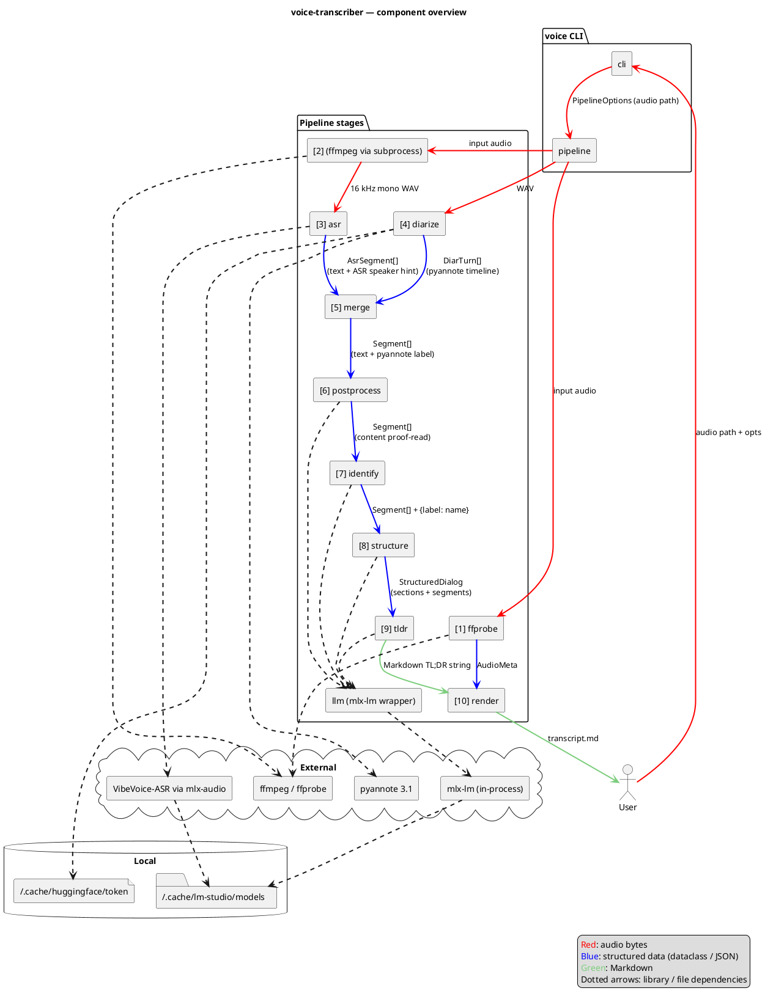

# Architecture

voice-transcriber is a thin CLI on top of a linear in-process pipeline. The CLI parses arguments, builds a `PipelineOptions`, and hands it to `pipeline.run()`. Each stage is a small module with a single public function; intermediate results live in memory, and the only on-disk artefact (besides the input audio) is the final Markdown file.

External work — ASR inference, diarization, LLM prompting — is delegated to local libraries so the pipeline contains no model code itself: mlx-audio drives the VibeVoice model directly, pyannote.audio runs the diarization graph on the local GPU/CPU, and `llm.py` loads the LLM in-process via `mlx-lm` (no HTTP).

## Component diagram



![Architecture overview](https://www.plantuml.com/plantuml/svg/RLLVRzis47_dfpXuBpOAsqkxDPjN6CsSUUrWhqMSPGCoFT0IBHEcI86aahX5Xts8VS9zajsHaYLhUR3Ck_lT_plohVFS-gfGp4kl13mOcOgnjroxrCgjiF3lt_z0QehIQA4zc0TX7wHuPEuWTSajBrhXnX_HWXMfvpfNeWEvijOytkvbUj32ENZ964-ziV2R4vQnagS7dWiO1EUmMBqVm6S67Q-3LCa1S4UoSq4fIw6a5a7wiIRObuxHXWcOQIxS_qpVNoImsvNMRAEHvR8dVvd0SBShIf73W-JWgYs2KynZ5F2_Nztr55uboBT1UBMvwGc_II2JtCfFqTirddk8RnCeXCsZV4sd7k1r0gLnleuYPevq3tMPWCpmA7V707bFH0_pNO9LiLNgAnlTRGBLGtsVW5TPJEXsTTtFwEBh19kkCn4HD-5uZb6gW66XdiRu_sXvMGeRYxTQhQbPgJ9L1eEVdhomcglOe_kwwDEcFKbeJs2I-0x7yowCArOvj8Oyy2gJ9Y3Ngpy8LXwvriOBU3Mv2FoFDOE4TKn3gSTDKwEkUbeL55d6FTzoXtEqCcaJsSueJ146VqqdAK_tOggAiVFaU5gOJAZOazLwio0fAKXSZ1Q-h_9Swdp7Kp7rvY1qmBzRtjAPlD9UmFZ-AokoP3odgOSPXCoWv7uFBy2KtZ7YjwZJeCzEnm-bbqOx6BQw8yPEm5ONXnZLS5qh7_qmuhHogl0CBbx3uTqdA8msOUoVCRHSzkmW0wLRLGaIn-50o1K9ry9pniXs1n8cdX3ERaHUuFpS9t_geHTF7lCci2i5Fw2LlTH-z5mGj5HeWK8CnsUi4_-siZhOFes8bqMmDM8Hrr6a3KEzPq8wQIk-5Ge38cH7ConUJpKrsXCNXyxinbRmRCGYhgCObx6hYTu-1oypqBmGNrWDwIZHWf9AizOPPgfCZZuTNinX6bw0YmRTY0Kugbyk5jUNYxCMhRazPEPHeyaV48GN1SuigyLdAc5SPz2y6gMV51aB4pIPp9kDnK7eKDH78cb9yHVEfuK9JIFEQLLFd6P9Gf634juWiN8DLTUa8KE63O6_w3RiT_YUksPAv9WXM9dlwHvyanfbx0phEByHsPjf8EVDCcwFNhWMHJsO_uYV5dUwNZEWgmI6z4qLnrTm2hziFlmwQjNhYiv_jaBeraJJ1mHU6-_H4gVdrCr0oQtbzaWt95qmcIYfEJgL61Gb4NDXR_63B_n_)

## Module layout

```
src/voice/
├── cli.py           # argparse, --help, dispatch to pipeline.run()
├── pipeline.py      # PipelineOptions + run(): ffmpeg → ffprobe → ASR → diarize → merge → post → identify → structure → tldr → render
├── types.py         # shared dataclasses (AsrSegment, DiarTurn, Segment, Section, StructuredDialog, AudioMeta)
├── ffprobe.py       # extract_metadata(): start/end/duration from ffprobe → birthtime → mtime
├── asr.py           # transcribe(): mlx-audio wrapper, bitness 4/5/6/8, JSON timeline parse
├── diarize.py       # diarize(): pyannote 3.1, MPS+CPU fallback, exclusive turns
├── merge.py         # merge(): per-segment max-overlap mapping ASR↔pyannote
├── postprocess.py   # fix_asr_errors(): per-segment LLM proofreader with safety net
├── identify.py      # identify_speakers(): LLM self-intro detection with override / ask / keep
├── structure.py     # structure_dialog(): LLM-driven section layout with validation
├── tldr.py          # generate_tldr(): LLM markdown summary
├── render.py        # render_markdown(): final output
├── speaker_emojis.py # fixed palette assignment
└── llm.py           # MlxLLM: in-process mlx-lm wrapper with chat / chat_json (lm-format-enforcer)
```

## Data flow

The pipeline passes increasingly enriched `Segment` lists from stage to stage. Numbers match the labels in the diagram and the log lines.

1. **ffprobe** — `extract_metadata(audio)` → `AudioMeta` (start/end/duration). Goes straight to render.
2. **WAV conversion** — `ffmpeg` subprocess writes a 16 kHz mono WAV to a temp dir.
3. **ASR** — `asr.transcribe(wav)` → `AsrSegment[]` (text + ASR-side speaker hint).
4. **Diarize** — `diarize.diarize(wav)` → `DiarTurn[]` (pyannote timeline).
5. **Merge** — joins (3) and (4) into `Segment[]` (text + pyannote speaker label).
6. **Postprocess** — LLM proof-reads `content` per segment in-place.
7. **Identify** — LLM returns `{label → name}`; pipeline assigns `.name` on each segment.
8. **Structure** — LLM produces `StructuredDialog` (segments + section titles).
9. **TL;DR** — LLM emits a Markdown summary string.
10. **Render** — combines `AudioMeta`, `StructuredDialog`, and the TL;DR into the final Markdown file.

See [`pipeline.md`](pipeline.md) for the step-by-step sequence with timing details, and [`adr/`](adr/) for the decisions behind these boundaries.
