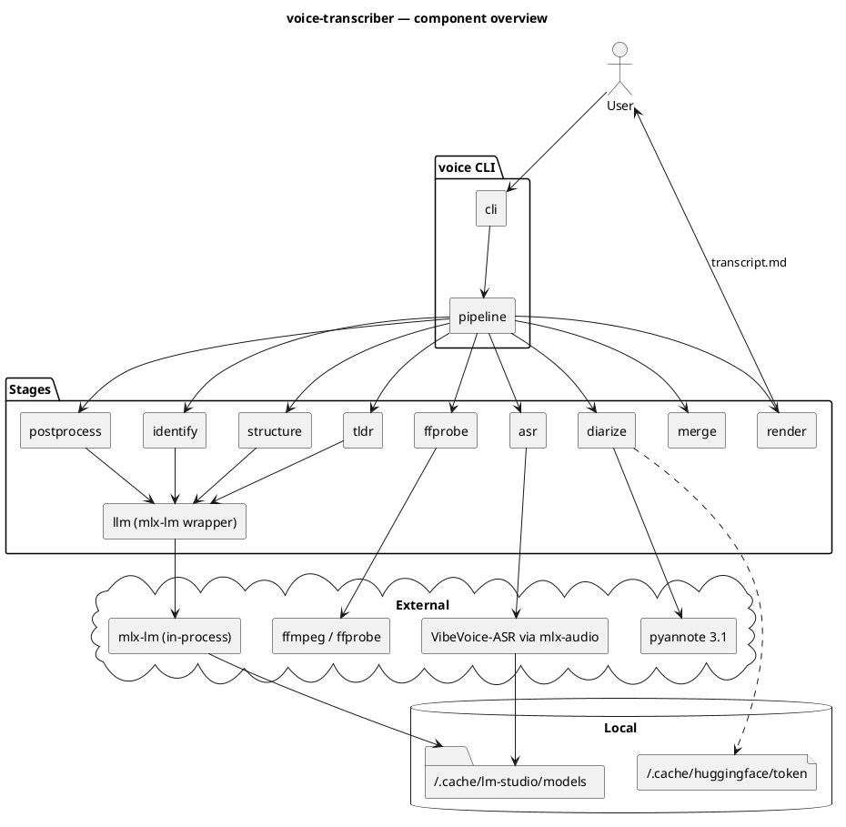

# Architecture

voice-transcriber is a thin CLI on top of a linear in-process pipeline. The CLI parses arguments, builds a `PipelineOptions`, and hands it to `pipeline.run()`. Each stage is a small module with a single public function; intermediate results live in memory, and the only on-disk artefact (besides the input audio) is the final Markdown file.

External work — ASR inference, diarization, LLM prompting — is delegated to local libraries so the pipeline contains no model code itself: mlx-audio drives the VibeVoice model directly, pyannote.audio runs the diarization graph on the local GPU/CPU, and `llm.py` loads the LLM in-process via `mlx-lm` (no HTTP).

## Component diagram




## Module layout

```
src/voice/
├── cli.py           # argparse, --help, dispatch to pipeline.run()
├── pipeline.py      # PipelineOptions + run(): ffmpeg → ffprobe → ASR → diarize → merge → post → identify → structure → tldr → render
├── types.py         # shared dataclasses (AsrSegment, DiarTurn, Segment, Section, StructuredDialog, AudioMeta)
├── ffprobe.py       # extract_metadata(): start/end/duration from ffprobe → birthtime → mtime
├── asr.py           # transcribe(): mlx-audio wrapper, bitness 4/5/6/8, JSON timeline parse
├── diarize.py       # diarize(): pyannote 3.1, MPS+CPU fallback, exclusive turns
├── merge.py         # merge(): per-segment max-overlap mapping ASR↔pyannote
├── postprocess.py   # fix_asr_errors(): per-segment LLM proofreader with safety net
├── identify.py      # identify_speakers(): LLM self-intro detection with override / ask / keep
├── structure.py     # structure_dialog(): LLM-driven section layout with validation
├── tldr.py          # generate_tldr(): LLM markdown summary
├── render.py        # render_markdown(): final output
├── speaker_emojis.py # fixed palette assignment
└── llm.py           # MlxLLM: in-process mlx-lm wrapper with chat / chat_json (lm-format-enforcer)
```

## Data flow

The pipeline passes increasingly enriched `Segment` lists from stage to stage:

1. `asr.transcribe()` produces `AsrSegment[]` (text + ASR-side speaker hint)
2. `diarize.diarize()` produces `DiarTurn[]` (pyannote timeline)
3. `merge.merge()` joins them into `Segment[]` (text + pyannote speaker label)
4. `postprocess.fix_asr_errors()` updates `content` per segment
5. `identify.identify_speakers()` returns a `{label → name}` map; pipeline assigns `.name`
6. `structure.structure_dialog()` wraps `Segment[]` into `StructuredDialog` with sections
7. `tldr.generate_tldr()` produces a Markdown string
8. `render.render_markdown()` combines `AudioMeta` + `StructuredDialog` + `tldr` into one file

See [`pipeline.md`](pipeline.md) for the step-by-step sequence with timing details, and [`adr/`](adr/) for the decisions behind these boundaries.
