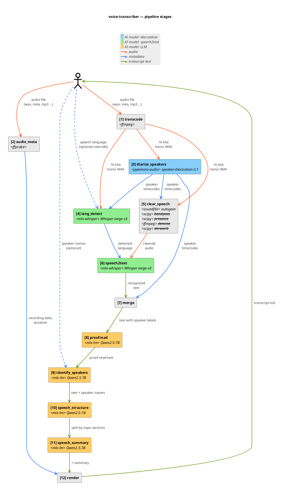

# Architecture

voice-transcriber is a thin CLI on top of a linear in-process pipeline. The CLI parses arguments, builds a `PipelineOptions`, and hands it to `pipeline.run()`. Each stage is a small module with a single public function; intermediate results live in memory, and the only on-disk artefact (besides the input audio) is the final Markdown file.

External work — ASR inference, diarization, LLM prompting — is delegated to local libraries so the pipeline contains no model code itself: `mlx-whisper` drives the Whisper model directly, pyannote.audio runs the diarization graph on the local GPU/CPU, and `llm.py` loads the LLM in-process via `mlx-lm` (no HTTP).

## High-level architecture

The CLI hands a `PipelineOptions` (whose load-bearing field is the audio path) to `pipeline.run()`. The orchestrator delegates the heavy work to four external libraries — `ffmpeg`/`ffprobe`, `mlx-whisper` (Whisper-large-v3-MLX), `pyannote.audio`, `mlx-lm` — and writes a single Markdown file back to the user.

The split between the CLI and the pipeline is intentional: `cli.py` only resolves user input (argument parsing, defaults, `--help`) and `pipeline.run()` is the single entry point both the CLI and the test suite call. That makes ordering tests possible without a subprocess — `tests/test_pipeline_ordering.py` monkey-patches each module-level reference and asserts the call sequence directly.

Models are never loaded twice. ASR (mlx-whisper), diarization (pyannote 3.1) and the LLM (mlx-lm) each load their weights inside their stage and free them on return; the LLM is then loaded for the four LLM-driven stages (`proofread`, `identify_speakers`, `speech_structure`, `speech_summary`) and unloaded before `render`. By default a single LLM serves all four stages; the per-stage flags `--llm-{proofread,identify,structure,tldr}-model` opt into a different model per stage and the pipeline cold-swaps the resident model between stages whose paths differ (see [ADR 0019](adr/0019-per-stage-llm-models.md)). Combined with the in-process design — no HTTP, no daemon — this keeps peak GPU memory bounded by the largest single model, not by their sum.

The only on-disk artefacts the pipeline writes itself are the final Markdown file and an optional per-stage dump tree (`--dump-stages DIR`) used for regression triage. Everything else — temp WAV files, model caches — lives outside the pipeline contract: `~/.cache/huggingface/hub/` for the default LLM (`Qwen2.5-7B-Instruct-4bit`, see [ADR 0020](adr/0020-default-llm-qwen25-7b.md)) and Whisper ASR; `~/.cache/lm-studio/models/` for any LLM checkpoints populated through LM Studio's GUI; `~/.cache/huggingface/token` for the pyannote gated-repo token; a `tempfile.mkdtemp()` directory for the ffmpeg WAV that is cleaned up on return.

## Pipeline stages

> Numbering convention: this document and the component diagram below count **twelve** boxes (render = `[12]`). The runtime log lines in `pipeline.py` and the stage table in [`pipeline.md`](pipeline.md) count **eleven** stages because `render` is pure Python without a `_timed` context — its wall-clock rolls into the total. Stage `[4] lang_detect` is conditional: it runs only when `--language` is omitted; the progress label `[4/11]` is the same whether the stage runs or is skipped. Both views describe the same pipeline; see [#83](https://github.com/artem-from-ua/voice-transcriber/issues/83) for the tracking issue on unifying the count.

`pipeline.run()` runs eleven steps in order. transcode (ffmpeg → 16 kHz mono WAV) and audiometa (ffprobe) both start from the user's input file; diarize then reads the temp WAV first to produce per-turn boundaries, the **clearspeech** stage uses those boundaries as guard-rails for a chain of DSP effects (autogain, optional bandpass), and speech2text finally consumes the output of the last applied effect. Everything from merge onwards passes structured Python dataclasses around. Only the final two edges (TL;DR string → render → file) are Markdown. The clearspeech chain currently absorbs autogain, bandpass, presence, denoise, and dereverb effects (added incrementally in v0.10–v0.17); the chain is open-ended and new effects can be appended without growing the stage count.



![Pipeline stages](https://www.plantuml.com/plantuml/svg/jPVlRjis4C2_woaEpPSDYvpOJfm_48JcZuqLI80kwTOFdH7GqiKX8f42IITrXm7REnHxc3rEdsH7KhOiH_AyeeiJ8pBlVdUyEzxHhxLXoipoB33SP0XFaYSO6iM4JXIVe88lVto6WXUOSO50qbFKWNxaec2AvP38l902XRarSr9Nc1WcfXckY9mf9P_VFV3aKQ3Mq5jPod2A8ZsNAaLr8JEfm5ccHIA-b6F9urJ9cKYzxCxG_GH1fAtnE018PJBBIHT-emU0QwQcN43la9v-fp-M6DBpQrUqdyghWrNvG_VmbgKf5rFmoj5UQIJma5VqOXf-rgY2O1a5U1LDuW_TiTz78bECzYRnhoBYSNH_dnSuZQCz7ZlLzsU_q1QExMiTq1i3cwLStkLes2gXK7A25M8qQYFqnv1oflWdlDC5iaTKkk8KSoQ4D1Ww8p6K4g7NO8PB4VOxtQMPI_eSTewFBeQZitL31sF8AEDtAHhAVMKZppw6pm-Sq2g6z_wVCAFuOlZKNvAlIFKI3UoSx0-79_lhyCCn91aoPVU0oKD5rxOAxZdbWm9bv9HnOPdbOiABUGoHZYTCf0NJj7KTDwqN2ZMA1ElhPQAiG8f2Serj-bIs-8HgibXtUxguRKlAO0n-8ps37_zphCvkRzhYT3I674dS8ftijNrgS-Du35H7ybuXI-jEP7aCFpsZw7KEmwFpfUMtKbEAHgEBYy5W7NOo1avHCln-tb1f6w1lh5ORjRk_2DMTDcgMc9d2hQYtJheLswsmipndQhuLzDtLvKqhaiugTIkgX6NmRzpZClg1xH4GVY30uBn_E0vZUsvF8Kfi5plTETYthnZyaGTRrT6UMxEUhGjzzyoUTY4_OFHMzA7JwNo_a6umP7lC_scfVtxS6mrsKwOVCBK65mUwmQWFlEiMCpRTQ5aMjWUn32ITBaNrjOLbNq_DTcrLWc0vwcsiLiO26xzQG5qhR33I7S3ZZvysq7Cff4t7alq2lI5qtu1ENUcRW5q0bl7_zvJRq6_W6vwZ7PDwWu5crx-6lN2rXhTzjO7l1ngc6moibt90djQ2teAsCqri9Bi3MfMXvH1uC3mPTaSMxFjx0vekO78gQEnlellfqnhlLlZNX3pmj9htRfuqyArVyCpDm_BCPco2MGLpYZLKwwbt4owq8ww-NQzGOvGpeysX7vexI52grL1kKZH6BkC69dCmik09QAeiQZKhKQA9KCj1EKDQCgpSnJHb1dSt92ETANUNMrfntjNyRJT3krvCo5AxbAtfksxS5BZo2qHXEdbQxTBVusqG8A4qqDKP89hGjVwql5sIAj0SfK_eVaL3kSuzUqFzACNi55PkgWkwdTOLpj-JjiNLRcLDE3_xjyLTNLslOqfHtnhYBv__jBz__RqGQy3LMi0QnjV9LXZx3O8AXRMGV2gt8bKvXHU1ibdroGrUqnjzd_m7)

## Module layout

```
src/voice/
├── cli.py           # argparse, --help, dispatch to pipeline.run()
├── pipeline.py      # PipelineOptions + run(): transcode → audio_meta → diarize_speakers → clear_speech → speech2text → merge → proofread → identify_speakers → speech_structure → speech_summary → render
├── types.py         # shared dataclasses (AsrSegment, DiarTurn, Segment, Section, StructuredDialog, AudioMeta)
├── transcode.py     # transcode(): ffmpeg → 16 kHz mono PCM WAV
├── audio_meta.py    # extract_metadata(): start/end/duration from ffprobe → birthtime → mtime
├── diarize_speakers.py  # diarize(): pyannote 3.1, MPS+CPU fallback, exclusive turns
├── clear_speech.py  # clearspeech(): chain-of-DSP-effects (autogain + bandpass + presence + denoise + dereverb)
├── whisper_asr.py   # transcribe(): mlx-whisper wrapper, the ASR backend (see ADR 0017, 0021)
├── lang_detect.py   # detect_language_on_longest_turn(): Whisper-based pre-ASR LID (see ADR 0022)
├── download_whisper.py # `voice download-whisper` subcommand: prefetch Whisper model into HF cache
├── merge.py         # merge(): per-segment max-overlap mapping ASR↔pyannote
├── proofread.py     # fix_asr_errors(): per-segment LLM proof-reader with safety net
├── identify_speakers.py  # identify_speakers(): LLM self-intro detection with override / ask / keep
├── speech_structure.py   # structure_dialog(): LLM-driven section layout with validation
├── speech_summary.py   # generate_tldr(): LLM markdown summary
├── render.py        # render_markdown(): final output
├── speaker_emojis.py # fixed palette assignment
└── llm.py           # MlxLLM: in-process mlx-lm wrapper with chat / chat_json (lm-format-enforcer)
```

## Data flow

The pipeline passes increasingly enriched `Segment` lists from stage to stage. Numbers match the labels in the diagram and the log lines.

1. **transcode** — `transcode.transcode(audio, wav)` runs `ffmpeg` and writes a 16 kHz mono PCM WAV to a temp dir.
2. **audiometa** — `audiometa.extract_metadata(audio)` → `AudioMeta` (start/end/duration). Goes straight to render.
3. **Diarize** — `diarize.diarize(wav)` → `DiarTurn[]` (pyannote timeline). Runs on the raw WAV so its boundaries are not influenced by autogain.
4. **lang_detect** (conditional — runs only when `--language` was not given) — `lang_detect.detect_language_on_longest_turn(wav, turns)` picks the longest pyannote turn from (3), slices it from the raw WAV, computes its log-mel spectrogram, and calls `model.detect_language()` on Whisper-large-v3-MLX. The top-1 ISO code becomes `effective_language` and flows through every downstream stage that reads `language=`. When `--language` is given explicitly, this stage is skipped entirely. See [ADR 0022](adr/0022-asr-language-autodetect.md).
5. **Clearspeech** — `clearspeech.clearspeech(wav, chain, autogain_turns=turns, ...)` runs an ordered chain of DSP effects. Available effects: `autogain`, `bandpass`, `presence`. Chain is configured by the single `--clearspeech-chain` CLI flag (default `"autogain"`). Each enabled effect writes a sibling WAV (`<stem>.autogain.wav`, `<stem>.autogain.bandpass.wav`, `<stem>.autogain.bandpass.presence.wav`, …) and the next effect reads it; speech2text consumes the last applied effect's output. With `--clearspeech-chain ""` the chain is empty and speech2text receives the raw WAV. See [ADR 0010](adr/0010-clearspeech-chain.md) for the chain-of-effects design, [ADR 0012](adr/0012-clearspeech-chain-string-cli.md) for the single-string CLI, and [ADR 0016](adr/0016-rename-agc-to-autogain.md) for the `agc` → `autogain` rename.
6. **speech2text** — `whisper_asr.transcribe(cleaned_wav, language=effective_language)` → `AsrSegment[]` via `mlx-whisper` against `mlx-community/whisper-large-v3-mlx`. The `effective_language` value is either the CLI `--language` override or the ISO code computed by `[4] lang_detect`. Whisper produces no speaker hint; speaker labels come entirely from pyannote turns at stage 7 (merge). See [ADR 0017](adr/0017-whisper-asr-backend.md) for how this backend was chosen and [ADR 0021](adr/0021-remove-vibevoice-backend.md) for why it is now the only backend.
7. **Merge** — joins (3) and (6) into `Segment[]` (text + pyannote speaker label).
8. **Proofread** — LLM proof-reads `content` per segment in-place.
9. **Identify** — LLM returns `{label → name}`; pipeline assigns `.name` on each segment.
10. **Structure** — LLM produces `StructuredDialog` (segments + section titles). Short dialogues (≤60 segments) go through one LLM call; longer dialogues are split into overlapping ~35-segment chunks, the LLM is called per chunk, and `_reconcile_chunks()` stitches the per-chunk section lists into a single contiguous layout (see [ADR 0018](adr/0018-chunked-structure-dialog.md)).
11. **TL;DR** — LLM emits a Markdown summary string.
12. **Render** — combines `AudioMeta`, `StructuredDialog`, and the TL;DR into the final Markdown file.

See [`pipeline.md`](pipeline.md) for the step-by-step sequence with timing details, [`prompts.md`](prompts.md) for the LLM call contracts powering stages 8–11, and [`adr/README.md`](adr/README.md) for the index of architectural decisions behind these boundaries.
