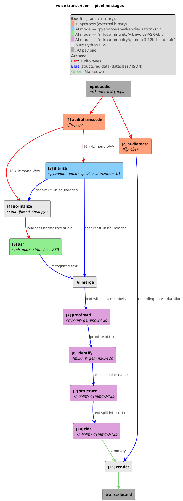

# Architecture

voice-transcriber is a thin CLI on top of a linear in-process pipeline. The CLI parses arguments, builds a `PipelineOptions`, and hands it to `pipeline.run()`. Each stage is a small module with a single public function; intermediate results live in memory, and the only on-disk artefact (besides the input audio) is the final Markdown file.

External work — ASR inference, diarization, LLM prompting — is delegated to local libraries so the pipeline contains no model code itself: mlx-audio drives the VibeVoice model directly, pyannote.audio runs the diarization graph on the local GPU/CPU, and `llm.py` loads the LLM in-process via `mlx-lm` (no HTTP).

## High-level architecture

The CLI hands a `PipelineOptions` (whose load-bearing field is the audio path) to `pipeline.run()`. The orchestrator delegates the heavy work to four external libraries — `ffmpeg`/`ffprobe`, `mlx-audio` (VibeVoice-ASR), `pyannote.audio`, `mlx-lm` — and writes a single Markdown file back to the user.


## Pipeline stages

`pipeline.run()` runs eleven steps in order. audiotranscode (ffmpeg → 16 kHz mono WAV) and audiometa (ffprobe) both start from the user's input file; diarize then reads the temp WAV first to produce per-turn boundaries, the loudness-normalize stage uses those boundaries as guard-rails for per-segment AGC, and ASR finally consumes the normalised WAV. Everything from merge onwards passes structured Python dataclasses around. Only the final two edges (TL;DR string → render → file) are Markdown.



![Pipeline stages](https://www.plantuml.com/plantuml/svg/dPRTRgD65CVlUOgZ-2RnBlv8t3YnBBJUE6vJTJTHl4elKYu663iZ3pDq63PXh_eGVS8-ISyCDiR6f5Q5X60u_zyv3EU3JwacIcSnTpJJdC9toKBgQaL46YeMK0N__FKt92oXd0aAQBsagPEkc4Y88Z64Cawae4BFTOvoHKDDn9BJYib4AVdwxOM5Aq7J5CuTvtaSUFWqqq2oYCbnD_3-46FcnSd5HtWbtpz2F21uIWRGwNJ6NURvG5AuivBMvDeS5hA9Cz6TE38OQtUVwQgXKyO89wXvxlk5sq8i8rhw7oyMSKANdl5uOaY_JvwWDPjDUiF9FkLyJOcf9bL0ecH0juJPh0bmuKF4Y68_AlwJd0WXDNKjseCqeMH5bLiO4isaS2yw_P8-nNLeNGrlRcSr_i078LLC-8w7L6OYMZ1EFVW0Ov75IRuDzYlQG-lsoXpxk9_CrgejAEPlcoYVC4-URDvCveyb3A-XTTsxlRtkxRCkVOYfMjgmhEqNSzVaUUW3RgfSA4gYNVyyzc19uvYu5sx_F2XTFyWKF_zqEkbDf_kqAnzOX7TiaHy7kpFMJRHh7qj2PQ7E53qEDxVcJRn-pmVD8tKSwzjlqyT64gQveYAYgjpbHtjRRhDJr9Fxt58qybqFSxMsX0NWEAOAjaisvqOm3YMNQjGQzCpXzIzXzSiFYAMGHZJksiVUdjOcsD5Qwmd50SzeitfT8u2VG41WqXjhXQObnQgs8PYqh36up2BJdDooOg9DQrfJ7AEhn59aR0s4_KykXTLh-gORNwL1_b_luXIw2iYcUerZVCChqo-R3WAS19HlGLPMmHH9NkFOkdDDuUs-Jc5UqQ-p-d0W7yee18ahRxCMLJ0seGz3qeGp3Kne2IaE6Uo4bMt1BbkXhFFyuCTH4HDBY8Yc65QKATjJIv3rZwJXpSrqUFCUAysm75LUAjTsEzfY3ZaEfqjy2beceDZoHJkmJsktFyitmBRCssqujKCMGennALL-DYgTe2uWuMgqdYWUu4BNh7Zry0ByTg6PjwUuUrG9mY5W0aC-g-EA0V8ERdA7rHbHRdy6JZPJgjimdaxg7eevSBG7q_ImdyMPO3hlximNzp9W-e27eWl-Jm-LvkeoxVv9j3iuxARedU-uIN0Ik0-vVf42kZ2TFzGPnN_9EuoxxZqa9EVI3BojUZzdx8zLEcgtwqROxBn7MgfhwMkR6mIvhfHZAJPrv7t6KwEyd7cHAIK2f-OSSeBfreLVv_TVpmx4NHI6zxEYL3IIln2rYkJhjYHDvHG5v7p24_wf_Wi0)

## Module layout

```
src/voice/
├── cli.py           # argparse, --help, dispatch to pipeline.run()
├── pipeline.py      # PipelineOptions + run(): audiotranscode → audiometa → diarize → normalize → ASR → merge → proofread → identify → structure → tldr → render
├── types.py         # shared dataclasses (AsrSegment, DiarTurn, Segment, Section, StructuredDialog, AudioMeta)
├── ffprobe.py       # extract_metadata(): start/end/duration from ffprobe → birthtime → mtime
├── diarize.py       # diarize(): pyannote 3.1, MPS+CPU fallback, exclusive turns
├── audio_preprocess.py # loudness_normalize(): per-pyannote-turn RMS AGC with linear crossfades
├── asr.py           # transcribe(): mlx-audio wrapper, bitness 4/5/6/8, JSON timeline parse
├── merge.py         # merge(): per-segment max-overlap mapping ASR↔pyannote
├── proofread.py     # fix_asr_errors(): per-segment LLM proof-reader with safety net
├── identify.py      # identify_speakers(): LLM self-intro detection with override / ask / keep
├── structure.py     # structure_dialog(): LLM-driven section layout with validation
├── tldr.py          # generate_tldr(): LLM markdown summary
├── render.py        # render_markdown(): final output
├── speaker_emojis.py # fixed palette assignment
└── llm.py           # MlxLLM: in-process mlx-lm wrapper with chat / chat_json (lm-format-enforcer)
```

## Data flow

The pipeline passes increasingly enriched `Segment` lists from stage to stage. Numbers match the labels in the diagram and the log lines.

1. **audiotranscode** — `ffmpeg` subprocess writes a 16 kHz mono PCM WAV to a temp dir.
2. **audiometa** — `ffprobe.extract_metadata(audio)` → `AudioMeta` (start/end/duration). Goes straight to render.
3. **Diarize** — `diarize.diarize(wav)` → `DiarTurn[]` (pyannote timeline). Runs on the raw WAV so its boundaries are not influenced by AGC.
4. **Normalize** — `audio_preprocess.loudness_normalize(wav, turns)` → sibling `<stem>.normalized.wav` with per-turn AGC (RMS → target dBFS, clamped by max gain, 100 ms linear crossfades on boundaries). Skipped when `--no-loudness-normalize` is passed; ASR then receives the raw WAV instead.
5. **ASR** — `asr.transcribe(normalized_wav)` → `AsrSegment[]` (text + ASR-side speaker hint).
6. **Merge** — joins (3) and (5) into `Segment[]` (text + pyannote speaker label).
7. **Postprocess** — LLM proof-reads `content` per segment in-place.
8. **Identify** — LLM returns `{label → name}`; pipeline assigns `.name` on each segment.
9. **Structure** — LLM produces `StructuredDialog` (segments + section titles).
10. **TL;DR** — LLM emits a Markdown summary string.
11. **Render** — combines `AudioMeta`, `StructuredDialog`, and the TL;DR into the final Markdown file.

See [`pipeline.md`](pipeline.md) for the step-by-step sequence with timing details, [`prompts.md`](prompts.md) for the LLM call contracts powering stages 7–10, and [`adr/README.md`](adr/README.md) for the index of architectural decisions behind these boundaries.
