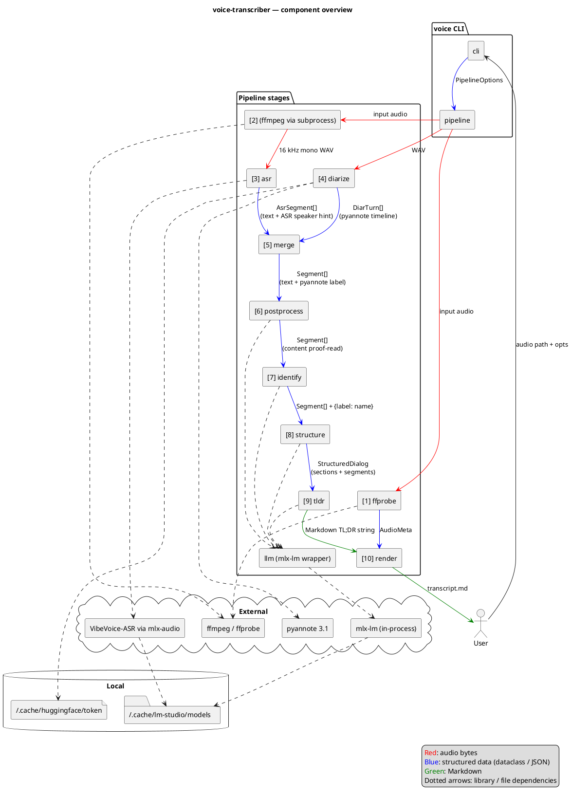

# Architecture

voice-transcriber is a thin CLI on top of a linear in-process pipeline. The CLI parses arguments, builds a `PipelineOptions`, and hands it to `pipeline.run()`. Each stage is a small module with a single public function; intermediate results live in memory, and the only on-disk artefact (besides the input audio) is the final Markdown file.

External work — ASR inference, diarization, LLM prompting — is delegated to local libraries so the pipeline contains no model code itself: mlx-audio drives the VibeVoice model directly, pyannote.audio runs the diarization graph on the local GPU/CPU, and `llm.py` loads the LLM in-process via `mlx-lm` (no HTTP).

## Component diagram



![Architecture overview](https://www.plantuml.com/plantuml/svg/RLLVRzis47_dfpXuBpO6sykwTPjN6CsQfUrWjqMSPGCoFT3IMIPCaG999N6B3lqG-uJx9BiZBLlHyc2QT_Ux_tVKIn-a2qsbHL118znPbUCuE6byxjGQ7VpxvH_8RLLRWoQ0lKDtf_1U-9qojNIoEWbNOKyM7EP1cbAZ438Fri7l7fqGjSntiaGOH0_mQl5s09y4T4mFSgq683tB7WjgLQDM1gFqmu4Gdpj6MoPGEYNw_vc-FSjWiwcTNISZbvSz-RSP33URgiOIxfG4twm9dAFteuZ_u_ocf_0i8xwBmlFLLK_uNGQ5aavzJDukwDv3V9z1XQvCyYNVUe3d6TJMXqCKANEYUwWVCb05NTLc7o5lcUXXVioeAgx9G-EIkrMaUgYVCWYwI0bTBoxw6Przar5dJO49SHMlZp5QLp2izCEO_k-Th6jqgNYBnPARbMlR533uzI6WCrAd7jqUYZvjsvF5zaGcYsze1c_YJ5ALOslOWsmAPIDokVYJOVLU6cC3mhF9MUH_E31OU8XfgCouRMhIrG-BYYChP91hwMcE5ZPl8zjOJId2uE_f99Vv5gUw6ll0ZgULBL2ddYoMgrSiPGL5qt-2RvkoLARSo1odmUxGHFoRosk-irVU2nYFvpplC8EO4zGoRE5hi7NmWldZsw_Mki6COCSPdnslx-kWhF5276M4TrWmd4QMaBIaJKYs1NDESgxd3CwUm-xDHwYiiN78dp1qUTcpGunEM6aK27BEmYK6AGJRxa3YV3F2knMM5KtBRVQN6GPy29GhWtsDSaTMjig4qLD1y0gH1GunNf-mplphnfbe-pWGGLNHraWaNBUWj4-azqH8HsqjrwWf84PsDEEQzLHpQm9pQSJiPknG5YEHS1t5j7fTJVBsANgPWP4LVXO7I4U9rv5LsYKkA5DjI_BfwQtb0I0ZFXdq8n7Xf5uwHFEeGqlfTeMzDsJnPyBGgq03AWxYhaOSpHcqdu4wJAf2nFcPJERjTj8OT2Zk8fEyaFIBz-Don9OnvxYMHqwx4B74KObUYrItbZfKf2LZVYr1l-Gsxd8y7xiM6ajA49mgj_pclSYjjcv6LPnVOV5Y6ibvktxhVK1_Gd47vh_GSS8Tdz82-Dc08P-vbjxJ6_RRwlsxqKazrdF-ci-JWRO91Bkm8P0TwPozzpFGQksas_DRo4z9WJLtnkIAGk8KKYRY9HtqmVuF)

## Module layout

```
src/voice/
├── cli.py           # argparse, --help, dispatch to pipeline.run()
├── pipeline.py      # PipelineOptions + run(): ffmpeg → ffprobe → ASR → diarize → merge → post → identify → structure → tldr → render
├── types.py         # shared dataclasses (AsrSegment, DiarTurn, Segment, Section, StructuredDialog, AudioMeta)
├── ffprobe.py       # extract_metadata(): start/end/duration from ffprobe → birthtime → mtime
├── asr.py           # transcribe(): mlx-audio wrapper, bitness 4/5/6/8, JSON timeline parse
├── diarize.py       # diarize(): pyannote 3.1, MPS+CPU fallback, exclusive turns
├── merge.py         # merge(): per-segment max-overlap mapping ASR↔pyannote
├── postprocess.py   # fix_asr_errors(): per-segment LLM proofreader with safety net
├── identify.py      # identify_speakers(): LLM self-intro detection with override / ask / keep
├── structure.py     # structure_dialog(): LLM-driven section layout with validation
├── tldr.py          # generate_tldr(): LLM markdown summary
├── render.py        # render_markdown(): final output
├── speaker_emojis.py # fixed palette assignment
└── llm.py           # MlxLLM: in-process mlx-lm wrapper with chat / chat_json (lm-format-enforcer)
```

## Data flow

The pipeline passes increasingly enriched `Segment` lists from stage to stage. Numbers match the labels in the diagram and the log lines.

1. **ffprobe** — `extract_metadata(audio)` → `AudioMeta` (start/end/duration). Goes straight to render.
2. **WAV conversion** — `ffmpeg` subprocess writes a 16 kHz mono WAV to a temp dir.
3. **ASR** — `asr.transcribe(wav)` → `AsrSegment[]` (text + ASR-side speaker hint).
4. **Diarize** — `diarize.diarize(wav)` → `DiarTurn[]` (pyannote timeline).
5. **Merge** — joins (3) and (4) into `Segment[]` (text + pyannote speaker label).
6. **Postprocess** — LLM proof-reads `content` per segment in-place.
7. **Identify** — LLM returns `{label → name}`; pipeline assigns `.name` on each segment.
8. **Structure** — LLM produces `StructuredDialog` (segments + section titles).
9. **TL;DR** — LLM emits a Markdown summary string.
10. **Render** — combines `AudioMeta`, `StructuredDialog`, and the TL;DR into the final Markdown file.

See [`pipeline.md`](pipeline.md) for the step-by-step sequence with timing details, and [`adr/`](adr/) for the decisions behind these boundaries.
