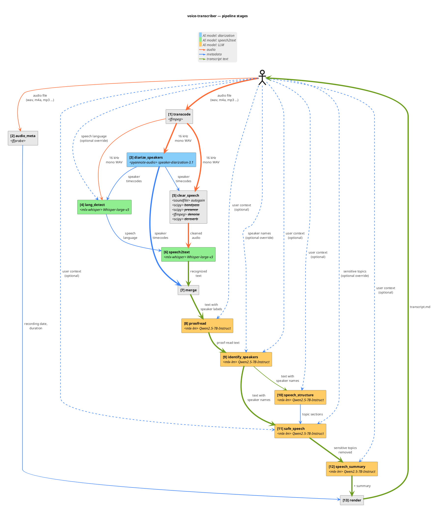

# Pipeline — step by step

`pipeline.run(PipelineOptions)` is the single entry point used by both the CLI and tests. It runs thirteen sequential stages; each stage gets the previous one's output and adds a layer of information.

## Stages

The component diagram below shows the same thirteen stages as boxes with their data-flow edges: solid orange = audio, solid blue = metadata, solid green = transcript text, dashed blue = optional CLI overrides (including `--language`, `--names`, `--safe-speech-topics`, and `--user-context`, which seeds the system prompt of every LLM stage — see ADR 0033). The table that follows it mirrors the diagram one row per box, naming the upstream stage for every input so the dependency graph reads off the rows.

![Pipeline stages](https://www.plantuml.com/plantuml/svg/lLXjJoCt4Fw-ls9qV6bLDa02uKNfwdYB3WcaArnx7wuHSdOdmSgklR8TEAwgrFw7KtzCVyxzaewzcxTb7G879H2nyVXvnZFZn-EyrOOfCyxIm72J8jnA7cDe51CwLhoF2hxzzHLodcFA1G9P3r47UiH5pXJB89PPBWKASsNkQRh2s30nJ77Ev50fUVVXXiSZWLf3SsuenI6Av4Yg1DMnJAK2nqo3XFZGZiMZeP9ZaHIsQwVk9mWwsf970K0Yut56S-4FUW2uO6h81JHtwEbF-cEneNd5s3cjP-RLzhpzZdjupvA4Yo4KapiR9KbGWBoX5zFmgqOL1DCem9jEF_gqrIlM4Si4Enlzw7VHuL5dCCXo74QT3HwvgHyFVwCbxDbN5Q3P0pPEkBpEqB1vX5p9FiuWkbqVGgi72MUAVy5hdICReT8pdFoU2I4DXeuaWj8YB6OmmwK8MusjASq9VGvhUxl7fzt3Aj5s3rBA-7M2Xd8_uyZIp-7T3ITe5S77ufymfVXYUDkQ8f_Jr1CqiBQ_UNgwlra5t-b1d29JTWqOtypGjQs20QTyKA2C738kB6Ov6FFyFeAEZlfC93dJj7GTrOtd2ZMA61V7oqHPWmI5v1fzywbiyHPLVpBkrdHyvKjAkmV5Gfe6FpyvLeTNbxuuxVOWGpAtaCxsmZxvtDZh0TMH72XaoQ8JQHR1BtSecesTSFSeF1FQgB7DQkd2UwafLztkyN6xNKNTxm6dS1a-kAyfkLNGp-nq7_pMvYHuryMqiSAdmL-vHoy-RLhD1lYWr5Q2febUuERCyN6MCNN_DEmFvoUNNcpQvYILL8RJp5-wnsdg0ojG47uYWFPHQwSNHbOq3g0JMmazMDlUjAy82hq1kwKw6sxCkbWr-k6EtQv3jiteBMz1ez7uSM9T8Let4sdzsP5QiNjDrjRHNhFRNa-Oli744awKfOQqo8QJhJ4RBcMMkHL3beAaRQwelbTWBigudjVk2X0iG_tIhAu4wqXHQ6xuBOAHEO-Vo-idTffGGpos4s8f2gbxdFHx8liANALQ_4zadkIz0fMJanUb2kpUzcvyrplKy6srOVJkonAcJ0ffPMFAiq3po1R_JlJg8kX8Vn4I5unfLXwNAIiNI_0Dpz3sc7e9GRthpy6UkBe0RviIhyGkWQ-ARq1-UiFl8R6jeS1a2OixNcQ5Qd68f7swVxhLhP8KBLCD3Trfv51G9xsCQNxRLBAmCj5paX8KQDvL-TJP-Wjtt2pBqUIyIbaVqncbW_GIUZNQjPoXxJaNWrLCcE8jrzwdkBrmp5Pfgcxx5FZvXEKY5dQBbyKUpNHKnrPRvo2ikTTbdv8_uSHNcD5HdyogYNh31OVBRjApAvIx7oVCuFeIacIit9Look8SzoxBJ_aJJ1le4gcqzMAvKx0ktkNt6xbfP7EhBxvci663cAg5RlO0dJwBHmVbvPUc0dNQz0bT_wX_NyGzF2F5Jp0zWBcBz0JTzlCpkE8QjohSmgMn3gwu7QmATtv-KOKfJGlvZRvz_Tl-_lFlnAm6Ra5QAp15_Qm4Ox_We09Y7gGYhIiXpN8A3m9bireaDtXBR-Ci_Gy0)

| # | Stage | Input (from) | Action | Output |
|---|-------|--------------|--------|--------|
| **1** | `transcode` | Original audio *(from user)* | **Normalize audio format** via `ffmpeg` | WAV (16 kHz mono PCM) |
| **2** | `audio_meta` | Original audio *(from user)* | **Extract recording start/end/duration** via `ffprobe`, `birthtime`, `mtime` | <ul><li>Recording date</li><li>Duration</li></ul> |
| **3** | `diarize_speakers` | WAV *(from `transcode`)* | **Who speaks when** AI model `speaker-diarization-3.1` | Turns (timecodes for each distinct speaker) |
| **4** | `lang_detect` | <ul><li>WAV *(from `transcode`)*</li><li>Turns *(from `diarize_speakers`)*</li><li>Language code *(optional, from user)*</li></ul> | **Auto-detect language** longest turn audio → AI model `Whisper-large-v3` | Language code |
| **5** | `clear_speech` | <ul><li>WAV *(from `transcode`)*</li><li>Turns *(from `diarize_speakers`)*</li></ul> | **Clean the audio for speech recognition** Apply a chain of audio effects (`autogain`, `bandpass`, `presence`, `denoise`, `dereverb`) | Cleaned WAV |
| **6** | `speech2text` | <ul><li>Cleaned WAV *(from `clear_speech`)*</li><li>Language code *(from `lang_detect`)*</li></ul> | **Convert audio to text** AI model `Whisper-large-v3` | Text segments (unattributed to speakers) |
| **7** | `merge` | <ul><li>Text segments *(from `speech2text`)*</li><li>Turns *(from `diarize_speakers`)*</li></ul> | **Attach speakers to text segments** Per-segment max-overlap mapping | Text segments (attributed to anonymous distinct speakers) |
| **8** | `proofread` | Text segments *(from `merge`)* | **Fix Automatic Speech Recognition mishearings** Per segment → AI model `Qwen2.5-7B-Instruct` | Text segments (proofread) |
| **9** | `identify_speakers` | <ul><li>Text segments *(from `proofread`)*</li><li>Speaker names *(optional override, from user)*</li></ul> | **Anonymous speaker labels → real speaker names** For each distinct speaker, identify how they introduce themselves in their first 60 seconds of speech to extract their name using AI model `Qwen2.5-7B-Instruct` | Text segments (attributed to named speakers) |
| **10** | `speech_structure` | Text segments *(from `identify_speakers`)* | **Identify and split the speech into thematic sections** For each group of segments → AI model `Qwen2.5-7B-Instruct` to detect topic-based sections | Topic sections |
| **11** | `safe_speech` | <ul><li>Text segments *(from `identify_speakers`)*</li><li>Topic sections *(from `speech_structure`)*</li></ul> | **Redact sensitive topics** For each section → AI model `Qwen2.5-7B-Instruct` to redact utterances on sensitive topics | Text segments (redacted) |
| **12** | `speech_summary` | Text segments *(from `safe_speech`)* | **Produce a TL;DR with overview, key points and action items** Whole flat transcript → AI model `Qwen2.5-7B-Instruct` | Markdown string |
| **13** | `render` | <ul><li>Recording date *(from `audio_meta`)*</li><li>Duration *(from `audio_meta`)*</li><li>Text segments *(from `safe_speech`)*</li><li>Topic sections *(from `speech_structure`)*</li><li>TL;DR *(from `speech_summary`)*</li></ul> | **Build final document** via markdown templating | Final markdown document |
