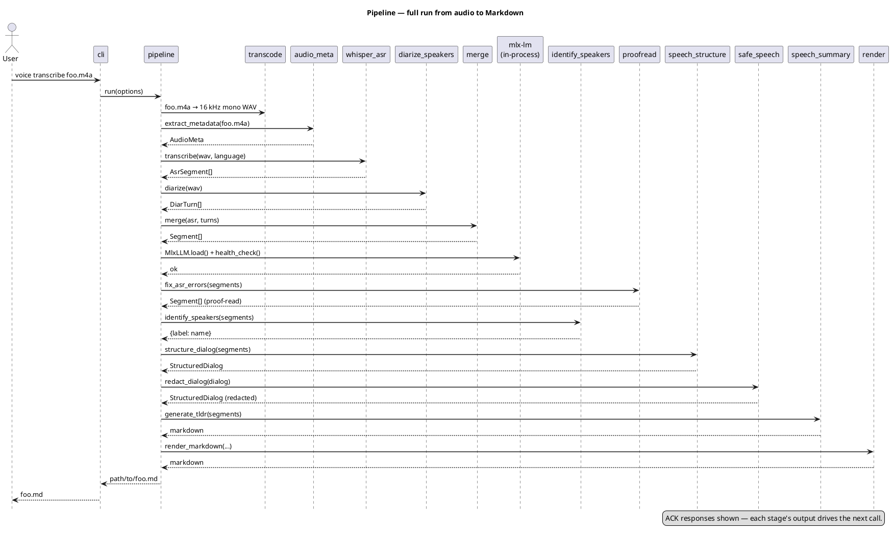

# Pipeline — step by step

`pipeline.run(PipelineOptions)` is the single entry point used by both the CLI and tests. It runs eleven sequential stages; each stage gets the previous one's output and adds a layer of information.

## Sequence

## Stages

Approximate wall-clock figures are for a 6-minute Ukrainian conversation on an M-series Mac with the default Whisper ASR backend and the v0.21 default LLM `mlx-community/gemma-3-12b-it-qat-4bit` already loaded. The v0.22 default `mlx-community/Qwen2.5-7B-Instruct-4bit` (see [ADR 0020](adr/0020-default-llm-qwen25-7b.md)) is ~2× smaller and typically faster on LLM stages; treat the numbers below as an upper bound for the new default. Re-measurement on Qwen is tracked in [#82](https://github.com/artem-from-ua/voice-transcriber/issues/82).

| # | Stage | Library | Input | Output | Typical time |
|---|-------|---------|-------|--------|--------------|
| 1 | WAV conversion | `transcode` (`ffmpeg` subprocess) | original audio | 16 kHz mono PCM WAV | < 1 s |
| 2 | Metadata | `audio_meta` (`ffprobe` subprocess) | original audio | `AudioMeta` (start/end/duration) | < 1 s |
| 3 | Diarization | `diarize_speakers` (`pyannote.audio` 3.1) | WAV | `DiarTurn[]` (exclusive) | ~30 s |
| 4 | lang_detect (conditional) | `mlx-whisper` (`model.detect_language` over the longest pyannote turn) | WAV + turns | ISO language code | ~3–5 s; skipped when `--language` is set. See [ADR 0022](adr/0022-asr-language-autodetect.md). |
| 5 | clear_speech | `clear_speech` (`soundfile` + `scipy` + `ffmpeg`) | WAV + turns | cleaned WAV | < 5 s (autogain only; longer chains add per-effect overhead) |
| 6 | ASR | `whisper_asr` (`mlx-whisper`) | cleaned WAV | `AsrSegment[]` | ~1 min |
| 7 | Merge | pure Python | ASR + diar | `Segment[]` | < 1 s |
| 8 | ASR proof-read | LLM via in-process `mlx-lm` | `Segment[]` | `Segment[]` | ~30–60 s |
| 9 | identify_speakers | LLM via in-process `mlx-lm` | `Segment[]` | `{label: name}` | ~5–10 s |
| 10 | speech_structure | LLM via in-process `mlx-lm` | `Segment[]` | `StructuredDialog` | ~10–20 s |
| 11 | safe_speech | LLM via in-process `mlx-lm` | `StructuredDialog` | `StructuredDialog` (redacted) | ~5–15 s; skipped when `--no-safe-speech` or `--safe-speech-topics ""`. See [ADR 0023](adr/0023-safe-speech-stage.md). |
| 12 | speech_summary | LLM via in-process `mlx-lm` | `Segment[]` (redacted) | Markdown string | ~10–20 s |

## Errors and recovery

| Failure | Stage | Behaviour |
|---------|-------|-----------|
| LLM model directory missing or invalid | health check | `MlxLLM.health_check()` raises `LLMError` with the actionable message *"… is not in the HuggingFace cache. Fetch it once with `huggingface-cli download <repo>`"* (or the equivalent for a filesystem path); pipeline exits before any LLM stage runs. See [`troubleshooting.md`](troubleshooting.md) and [ADR 0020](adr/0020-default-llm-qwen25-7b.md) |
| Hugging Face token missing | diarize_speakers | `DiarizationError` with path/`chmod` instructions |
| Gated repo not accepted on HF | diarize_speakers | `GatedRepoError` from pyannote; see [`troubleshooting.md`](troubleshooting.md) |
| ASR repetition loop | asr | `mlx-whisper` runs an internal temperature schedule that escapes most loops; `condition_on_previous_text=False` removes the dominant trigger. See troubleshooting if it persists. |
| LLM returns non-JSON for identify_speakers/speech_structure | identify_speakers / speech_structure | `lm-format-enforcer` guarantees valid JSON on the first try; if generation itself fails (e.g. model crash) → cluster stays unidentified / fallback to a single "Розмова" section |
| LLM rewrites text too aggressively | proofread | Levenshtein + length ratio check rejects the reply; original kept |
| LLM error in speech_summary | speech_summary | empty string returned; render simply omits the `## TL;DR` section |
| LLM error in safe_speech (one section) | safe_speech | that section is left unredacted; a warning is logged; other sections are processed normally |

The pipeline never aborts in the middle: if a non-critical LLM stage fails, that artefact is dropped and the rest still produces output.

## See also

- [`prompts.md`](prompts.md) — the LLM call contracts (temperature, max_tokens, response_format, safety nets) used by stages 8–12.
- [`adr/README.md`](adr/README.md) — index of the architectural decisions behind the stage layout.
