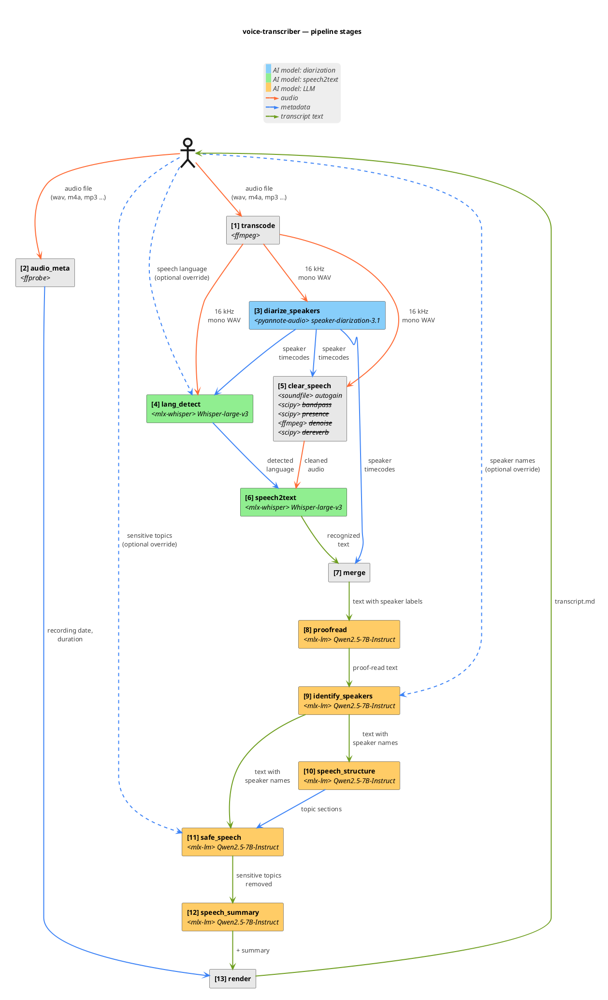

# Pipeline — step by step

`pipeline.run(PipelineOptions)` is the single entry point used by both the CLI and tests. It runs thirteen sequential stages; each stage gets the previous one's output and adds a layer of information.

## Stages

The component diagram below shows the same thirteen stages as boxes with their data-flow edges: solid orange = audio, solid blue = metadata, solid green = transcript text, dashed = optional CLI overrides. The table that follows it mirrors the diagram one row per box, naming the upstream stage for every input so the dependency graph reads off the rows.

![Pipeline stages](https://www.plantuml.com/plantuml/svg/jPVzJkD64C3_zrECZdzQ5GT887p8iewFH4K2wGhNtX_N26tiILXXxrgx6pYkgjI-m-aUvXxddgIpkyw7Wvq6IWaWpCxyPdPcFBFxLXkcp2JF0iDDXd0lUOAXKKpeHF4XAlZ-rnSeU84P5mWaFKOTw3ik2gPO3edC2obGc6lpIEeA4yF4ECC5aMEbvCFxMvxS2TGQsWjB6OvHf2TIfQXEPIOLECkqICIdSYov6oiv4QcNtUYvho28j3KU1m2fJ2OvwS8Vz01moTIO2sZlqTEVzCCIGtf-xOBsC_TgTr5-ppsyOsdAnHYyShHL6Wayv0rzc8PVDQeWc4K1taJ3-EFEmEyZaIb6MyFuTn7nE1gDyWB7SRJ5OwVwuVWtsiA1_Im3sWDWavJBcnmDMoGKIWvnZkZtcmYT0QISAVuPRtI1x0wLddEAHoQ4D1Ww8p6K4g7NO8PB4NPQEpCpP_H_s3ZOF-trZvSDxGuWeupVf6WeztCRUVOfVBZbX5OnVF1_X1d55yFxpenyGQfdQ63ZSBlNEznUXkyD8CcGARi7J6xdT6shOCGf7nGe8yUC2yii5nDUFCOGwNZ8H5emJLlNSTrweL2ZIB2wNYRA2gGe9DVOf4zbY_UeXjDrjwVJwwQaT0VWDz8s-EdPiJg-lcgAq_u0SYHnYtIob_QfoOs30L0ToP52bbQToF8OVdb0qMxjXViduRdGHariLaiNtabDkUhtJq-xtMNguG0uXSlmqMDDoQr3FxVgJVYTxMdmRhpQHE7pyDVkiP5FBwrc8tnIQckXIR4Ht9uxFibpfXwVntv_SNRLoARNd5ebbU4iyrVkSPRwm3Oe23yIe7lIsHk4iMqQHn0bjeKURUnksqyClj-0VQMYBRTcNLmM-k61tMz2lileLz61LglrurIwnf1jSF-dfSx9GRlVtKoPliNK6fnsangZFWEkLKtOUALbMTW6o3AGz6ehgkarBFlIhRThtmGGB4VzsbPTsTKPHQ6vuVS8HXOyUQdTm2Qmab4t26eCxdJXxkVFAypaKaXR3pFs4_IAtBq2dNhogu1T06Qf-FUQixbVmJSyHtj8q2iCrBl-4lRKrGhUJfKQlX_dcAumiFmk1UHf9UWDQ3lHnKgown3pChGS0dTxXxsTlWNxwLQ3fkEd70iwzAoY-zdR6Ez6-4j27dXQnNitH6lurYzuuEPsrZGoDiHi3dEA5LHZst7pFRG3lhfThr1Xb6DnbKChjbpRtshDDFIgbnif7Qyahz6AxOFK5nFRx1OGLhpYffks_wsbAiofbwRp6g21Mt6o7D4DzQlSfIDb1ZTN64adoftJPrQSuvMjD9lv2MOdaLAxbAtekx5J5yloSbYOLhwmItz7i-61XB9FroA0Q4XNjgFova2gGCSK-W-TdUdmK-KUdrEtJJ4xWeLRo9Hk3qDpd3y3hukhdBZhSFvejIxkuk9o6LEA-iONV__oj_t--cqgLeEhDBWbZA-JjJ3sTaY5mXf8FfLhaUOvXIU1ibdroGtUqgz9dlq3)

| # | Stage | Input (from) | Action | Output |
|---|-------|--------------|--------|--------|
| **1** | `transcode` | Original audio *(from user)* | **Normalize audio format** via `ffmpeg` | WAV (16 kHz mono PCM) |
| **2** | `audio_meta` | Original audio *(from user)* | **Extract recording start/end/duration** via `ffprobe`, `birthtime`, `mtime` | <ul><li>Recording date</li><li>Duration</li></ul> |
| **3** | `diarize_speakers` | WAV *(from `transcode`)* | **Who speaks when** AI model `speaker-diarization-3.1` | Turns (timecodes for each distinct speaker) |
| **4** | `lang_detect` | <ul><li>WAV *(from `transcode`)*</li><li>Turns *(from `diarize_speakers`)*</li><li>Language code *(optional, from user)*</li></ul> | **Auto-detect language** longest turn audio → AI model `Whisper-large-v3` | Language code |
| **5** | `clear_speech` | <ul><li>WAV *(from `transcode`)*</li><li>Turns *(from `diarize_speakers`)*</li></ul> | **Clean the audio for speech recognition** Apply a chain of audio effects (`autogain`, `bandpass`, `presence`, `denoise`, `dereverb`) | Cleaned WAV |
| **6** | `speech2text` | <ul><li>Cleaned WAV *(from `clear_speech`)*</li><li>Language code *(from `lang_detect`)*</li></ul> | **Convert audio to text** AI model `Whisper-large-v3` | Text segments (unattributed to speakers) |
| **7** | `merge` | <ul><li>Text segments *(from `speech2text`)*</li><li>Turns *(from `diarize_speakers`)*</li></ul> | **Attach speakers to text segments** Per-segment max-overlap mapping | Text segments (attributed to anonymous distinct speakers) |
| **8** | `proofread` | Text segments *(from `merge`)* | **Fix Automatic Speech Recognition mishearings** Per segment → AI model `Qwen2.5-7B-Instruct` | Text segments (proofread) |
| **9** | `identify_speakers` | <ul><li>Text segments *(from `proofread`)*</li><li>Speaker names *(optional override, from user)*</li></ul> | **Anonymous speaker labels → real speaker names** For each distinct speaker, identify how they introduce themselves in their first 60 seconds of speech to extract their name using AI model `Qwen2.5-7B-Instruct` | Text segments (attributed to named speakers) |
| **10** | `speech_structure` | Text segments *(from `identify_speakers`)* | **Identify and split the speech into thematic sections** For each group of segments → AI model `Qwen2.5-7B-Instruct` to detect topic-based sections | Topic sections |
| **11** | `safe_speech` | <ul><li>Text segments *(from `identify_speakers`)*</li><li>Topic sections *(from `speech_structure`)*</li></ul> | **Redact sensitive topics** For each section → AI model `Qwen2.5-7B-Instruct` to redact utterances on sensitive topics | Text segments (redacted) |
| **12** | `speech_summary` | Text segments *(from `safe_speech`)* | **Produce a TL;DR with overview, key points and action items** Whole flat transcript → AI model `Qwen2.5-7B-Instruct` | Markdown string |
| **13** | `render` | <ul><li>Recording date *(from `audio_meta`)*</li><li>Duration *(from `audio_meta`)*</li><li>Text segments *(from `safe_speech`)*</li><li>Topic sections *(from `speech_structure`)*</li><li>TL;DR *(from `speech_summary`)*</li></ul> | **Build final document** via markdown templating | Final markdown document |
