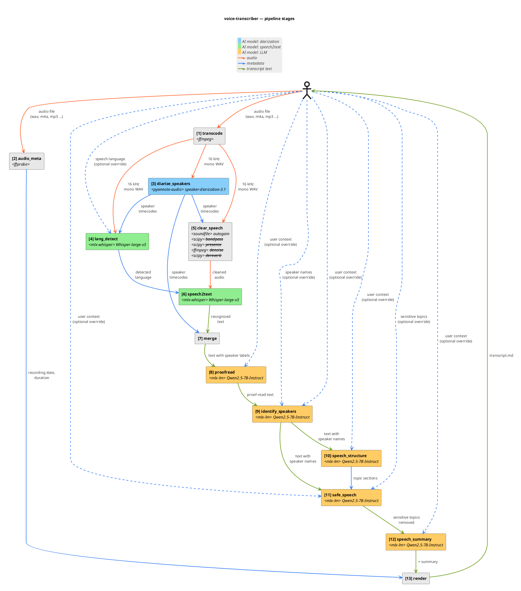

# Pipeline — step by step

`pipeline.run(PipelineOptions)` is the single entry point used by both the CLI and tests. It runs thirteen sequential stages; each stage gets the previous one's output and adds a layer of information.

## Stages

The component diagram below shows the same thirteen stages as boxes with their data-flow edges: solid orange = audio, solid blue = metadata, solid green = transcript text, dashed blue = optional CLI overrides (including `--language`, `--names`, `--safe-speech-topics`, and `--user-context`, which seeds the system prompt of every LLM stage — see ADR 0033). The table that follows it mirrors the diagram one row per box, naming the upstream stage for every input so the dependency graph reads off the rows.

![Pipeline stages](https://www.plantuml.com/plantuml/svg/lLXjJoCt4Fw-ls9qV6bLDa02uKNHwe1BL2IGhd3jVRX6oDcT18jTUsLxuRYgKliVJlqn_JdtIpgsDoyRTjE0u0X4R3ppFECP-_4uRxLXoXHP6XXkKeGxoMCCZM92nugFKC6tlxv2pdDCkK0WwmdgGDzoaJF5CeXbbak1mboP1t9N61ic9Yakc1mh9Uy_tF3uLg3Mq5uOId628ZcHAa5rAbEfm37J824-jcFnxKJ9GYJUTgFlVeAWforv500aCYuoyeK_w07WWga95z3UewS_wO_5Xlpys3dDPnxLxgBzddjupvA4YmbuvzvMIH9ua3VqOXf-rQY2O9O5UDCRHPzsXduUiKomjpMAVXSz7lN6uop7ITJRuf5p_NZy6qtXmBwM0Tf3O4N2vNM6XYqYv4gES0un63GXT8QGSARu5xpMER9RL7gEapym8QJ1q954K5g4teCPBaNOQUtCQDxHvx1ni7_Q7nml4-qE8QMANoTegFPpZYpz7DxVS89M4Npq_uGfvHV3kyuC-PnStw61ZSFjVlzmUnbyRmXnYapPEM1yCqVNTXMCETM34cNaX75XCSl1cESF4VHqD68YoPccgUkeRZnNg574M1ql2sKD4XIIQspofsMBTwX6qt4tfzEhfg9qX-0dqZRu-ScvEhwwRChJ_X0o97CBwMmlx5DJ60T3e7KanmfPKWqYpIBuvHv5kxKNxf-4Pq8RLTYgbY6ybvfgDHYSddQxowY7G-2KBiF73pLBRXtqC-lU1B-pFKtUjNSh53uD_iezDkBJfjLiZ8-MsbhGvDW8t9u7NcGPKmzFm_vm_kwo4PksEKabBSDPvI_TuwpqWHKe23yHGFUaipSC8oiQHz2BhOGURUnksrS4Nc_0RgdUbXkp8IuR_N3FxZOXssNqbdUWrMhzEBMk8R82zvfCdPE3zg2xcJ1zWuabdAf93QclW9EgWarMCilS2Y1BGTBMLhIcrs3sIxUUr-u442n3_TAiRjdLaQBGtF0x12Dp7Z-NjvdOwK0DSM4TOYcyl7sd5BycQQaPtvkreQwloUbavdKu0oi45MLm3KKDsKuNRd_-ie8caq9QNPbXFu9UeG4lW4vd-ui0kmJCol3_scKrP0M-uHdQPbEl8AWF_JdOqr0hyBOxgS7tRI4cAmYMDJcWI2j9Ru2sdQ5OYUnEclaoj3W4tEqVzdS65jXtIJNGT8sH4q7DyohqnHrHa-z6yEUaFF1ebUYRHDZ61VVStCmEdvIDC9s3ESSALAEskZunj8rYTRhUeOBHB9MpW5PCkVQShALfqCRdavI1LuhNo6BFKpfVOojs2n3Ml19cavm-uMXMc96M9lCrG8rR9SYorMjOlyfTNXDcS7C5IL8eTz-RiRZ0ArDffla9PXrjwLtQLlpTaLENo_9BXjoqieLP-hk-JG_4L7swNWFqHdJrFofleEGArExI9tG7eoQwYdjyHcgRO7e42xVPARfjgkTm_YwrBbpbvbO7vrlqTU7Epo-MOKfJBtpHjwz_szz__fsQrS1L16u9ng-JjM3ijmoqK5W3aY_bMaZpciAZHDcg-k86R-cjoDB_0000)

| # | Stage | Input (from) | Action | Output |
|---|-------|--------------|--------|--------|
| **1** | `transcode` | Original audio *(from user)* | **Normalize audio format** via `ffmpeg` | WAV (16 kHz mono PCM) |
| **2** | `audio_meta` | Original audio *(from user)* | **Extract recording start/end/duration** via `ffprobe`, `birthtime`, `mtime` | <ul><li>Recording date</li><li>Duration</li></ul> |
| **3** | `diarize_speakers` | WAV *(from `transcode`)* | **Who speaks when** AI model `speaker-diarization-3.1` | Turns (timecodes for each distinct speaker) |
| **4** | `lang_detect` | <ul><li>WAV *(from `transcode`)*</li><li>Turns *(from `diarize_speakers`)*</li><li>Language code *(optional, from user)*</li></ul> | **Auto-detect language** longest turn audio → AI model `Whisper-large-v3` | Language code |
| **5** | `clear_speech` | <ul><li>WAV *(from `transcode`)*</li><li>Turns *(from `diarize_speakers`)*</li></ul> | **Clean the audio for speech recognition** Apply a chain of audio effects (`autogain`, `bandpass`, `presence`, `denoise`, `dereverb`) | Cleaned WAV |
| **6** | `speech2text` | <ul><li>Cleaned WAV *(from `clear_speech`)*</li><li>Language code *(from `lang_detect`)*</li></ul> | **Convert audio to text** AI model `Whisper-large-v3` | Text segments (unattributed to speakers) |
| **7** | `merge` | <ul><li>Text segments *(from `speech2text`)*</li><li>Turns *(from `diarize_speakers`)*</li></ul> | **Attach speakers to text segments** Per-segment max-overlap mapping | Text segments (attributed to anonymous distinct speakers) |
| **8** | `proofread` | Text segments *(from `merge`)* | **Fix Automatic Speech Recognition mishearings** Per segment → AI model `Qwen2.5-7B-Instruct` | Text segments (proofread) |
| **9** | `identify_speakers` | <ul><li>Text segments *(from `proofread`)*</li><li>Speaker names *(optional override, from user)*</li></ul> | **Anonymous speaker labels → real speaker names** For each distinct speaker, identify how they introduce themselves in their first 60 seconds of speech to extract their name using AI model `Qwen2.5-7B-Instruct` | Text segments (attributed to named speakers) |
| **10** | `speech_structure` | Text segments *(from `identify_speakers`)* | **Identify and split the speech into thematic sections** For each group of segments → AI model `Qwen2.5-7B-Instruct` to detect topic-based sections | Topic sections |
| **11** | `safe_speech` | <ul><li>Text segments *(from `identify_speakers`)*</li><li>Topic sections *(from `speech_structure`)*</li></ul> | **Redact sensitive topics** For each section → AI model `Qwen2.5-7B-Instruct` to redact utterances on sensitive topics | Text segments (redacted) |
| **12** | `speech_summary` | Text segments *(from `safe_speech`)* | **Produce a TL;DR with overview, key points and action items** Whole flat transcript → AI model `Qwen2.5-7B-Instruct` | Markdown string |
| **13** | `render` | <ul><li>Recording date *(from `audio_meta`)*</li><li>Duration *(from `audio_meta`)*</li><li>Text segments *(from `safe_speech`)*</li><li>Topic sections *(from `speech_structure`)*</li><li>TL;DR *(from `speech_summary`)*</li></ul> | **Build final document** via markdown templating | Final markdown document |
