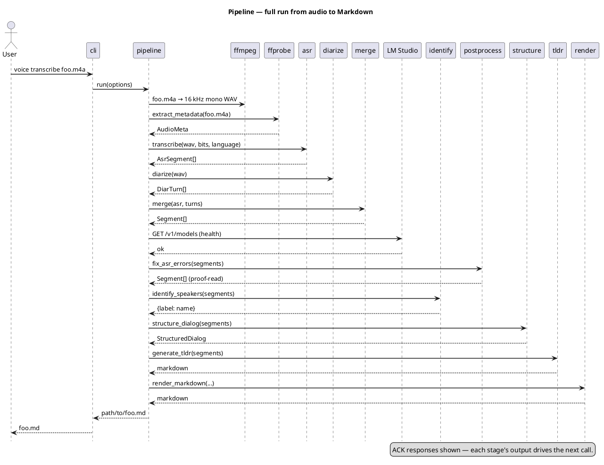

# Pipeline — step by step

`pipeline.run(PipelineOptions)` is the single entry point used by both the CLI and tests. It runs nine sequential stages; each stage gets the previous one's output and adds a layer of information.

## Sequence

## Stages

Approximate wall-clock figures are for a 6-minute Ukrainian conversation on an M-series Mac with the default 6-bit ASR and `mlx-community/gemma-3-12b-it-qat-4bit` already loaded.

| # | Stage | Library | Input | Output | Typical time |
|---|-------|---------|-------|--------|--------------|
| 1 | WAV conversion | `ffmpeg` (subprocess) | original audio | 16 kHz mono PCM WAV | < 1 s |
| 2 | Metadata | `ffprobe` (subprocess) | original audio | `AudioMeta` (start/end/duration) | < 1 s |
| 3 | ASR | `mlx-audio` (`mlx_audio.stt.generate_transcription`) | WAV | `AsrSegment[]` | ~2–4 min |
| 4 | Diarization | `pyannote.audio` 3.1 | WAV | `DiarTurn[]` (exclusive) | ~30 s |
| 5 | Merge | pure Python | ASR + diar | `Segment[]` | < 1 s |
| 6 | ASR proofread | LLM via LM Studio | `Segment[]` | `Segment[]` | ~30–60 s |
| 7 | Identify | LLM via LM Studio | `Segment[]` | `{label: name}` | ~5–10 s |
| 8 | Structure | LLM via LM Studio | `Segment[]` | `StructuredDialog` | ~10–20 s |
| 9 | TL;DR | LLM via LM Studio | `Segment[]` | Markdown string | ~10–20 s |
| 10 | Render | pure Python | everything | Markdown file | < 1 s |

## Errors and recovery

| Failure | Stage | Behaviour |
|---------|-------|-----------|
| LM Studio not running | health check | `RuntimeError` from CLI with the message *"LM Studio server is not reachable…"*; pipeline exits before any stage runs |
| Hugging Face token missing | diarize | `DiarizationError` with path/`chmod` instructions |
| Gated repo not accepted on HF | diarize | `GatedRepoError` from pyannote; see [`troubleshooting.md`](troubleshooting.md) |
| ASR repetition loop | asr | model usually escapes within seconds thanks to `repetition_penalty=1.2`; if it persists, retry with `--asr-bits 8` |
| LLM returns non-JSON for identify/structure | identify / structure | one automatic retry inside `llm.chat_json()`; on failure → cluster stays unidentified / fallback to a single "Розмова" section |
| LLM rewrites text too aggressively | postprocess | Levenshtein + length ratio check rejects the reply; original kept |
| LLM error in TL;DR | tldr | empty string returned; render simply omits the `## TL;DR` section |

The pipeline never aborts in the middle: if a non-critical LLM stage fails, that artefact is dropped and the rest still produces output.
